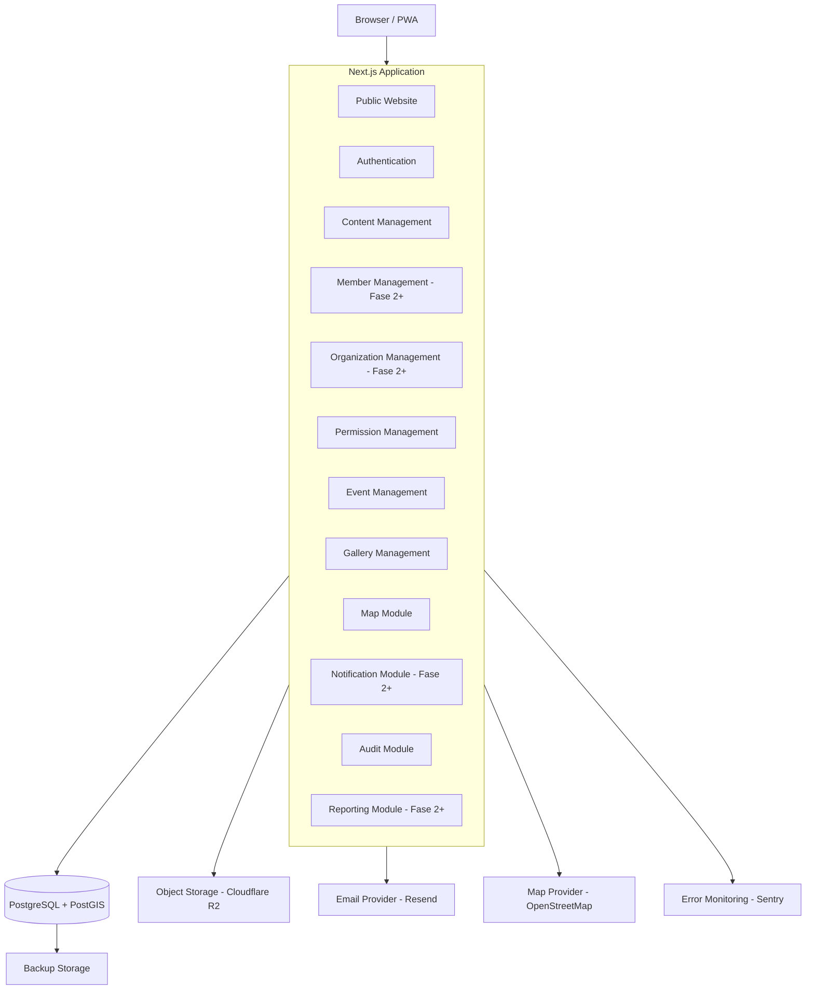

# Architecture Overview

Dokumen ini menjelaskan arsitektur teknis untuk proyek Rumah Pramuka Indramayu.

## Pendekatan: Modular Monolith

Sistem ini dirancang menggunakan pendekatan **Modular Monolith**. Kami memulai dengan monolitik yang modular (bukan microservices) untuk menjaga kompleksitas operasional tetap rendah, memaksimalkan kecepatan pengembangan awal, namun tetap mempertahankan batas-batas (boundaries) modul yang tegas sehingga di masa depan dapat diekstrak menjadi layanan terpisah jika diperlukan (fase lanjutan).

## Diagram Arsitektur

Berikut adalah diagram arsitektur tingkat tinggi dari sistem:



## Tech Stack Lengkap

### Tabel 1 — Core
| Area | Teknologi | Status |
|---|---|---|
| Framework | Next.js + TypeScript | Digunakan |
| Routing | Next.js App Router | Digunakan |
| Styling | Tailwind CSS + CSS Variables | Digunakan |
| Design system | CSS design tokens | Wajib |
| UI primitive | shadcn/ui + Radix UI | Terbatas |
| Form | React Hook Form + Zod | Digunakan |
| Validation | Zod (client + server) | Digunakan |
| Database | PostgreSQL | Digunakan |
| Geospatial | PostGIS | Digunakan |
| ORM | Prisma | Fase awal |
| Authentication | Auth.js + custom approval | Digunakan |
| Authorization | RBAC + scoped permission | Wajib |
| Data table | TanStack Table | Rekomendasi |
| Maps | Leaflet + OpenStreetMap | Digunakan |
| Object storage | Cloudflare R2 | Rekomendasi |

### Tabel 2 — Pendukung
| Area | Teknologi | Status |
|---|---|---|
| Queue | Redis + BullMQ | Saat diperlukan |
| Push notification | FCM | Fase lanjutan |
| Email | Resend / SMTP | Digunakan |
| Error monitoring | Sentry | Rekomendasi |
| Unit testing | Vitest | Digunakan |
| Component testing | React Testing Library | Digunakan |
| E2E testing | Playwright | Digunakan |
| CI/CD | GitHub Actions | Digunakan |
| PWA | Service worker / next-pwa | Bertahap |
| Deployment | Vercel | Digunakan |
| Package Manager | pnpm | Digunakan |
| Database Dev | Docker (PostgreSQL + PostGIS) | Digunakan |

## Struktur Repository

Struktur direktori proyek dirancang berdasarkan modularitas fitur (`features/`):

```text
project-root/
├── docs/
│   ├── product/
│   ├── design/
│   ├── organization/
│   ├── security/
│   ├── architecture/
│   ├── operations/
│   └── testing/
├── public/
│   ├── brand/
│   ├── icons/
│   └── images/
├── src/
│   ├── app/
│   │   ├── (public)/
│   │   ├── (auth)/
│   │   ├── (member)/
│   │   ├── (staff)/
│   │   └── (admin)/
│   ├── components/
│   │   ├── ui/
│   │   ├── public/
│   │   ├── dashboard/
│   │   └── shared/
│   ├── features/
│   │   ├── auth/
│   │   ├── public-site/
│   │   ├── news/
│   │   ├── gallery/
│   │   ├── events/
│   │   ├── members/
│   │   ├── organizations/
│   │   ├── assignments/
│   │   ├── permissions/
│   │   ├── consent/
│   │   ├── map/
│   │   ├── notifications/
│   │   ├── reports/
│   │   └── audit/
│   ├── lib/
│   │   ├── auth/
│   │   ├── permissions/
│   │   ├── validation/
│   │   ├── logger/
│   │   └── security/
│   ├── services/
│   ├── styles/
│   │   ├── tokens.css
│   │   ├── globals.css
│   │   └── utilities.css
│   └── types/
├── prisma/
│   ├── schema.prisma
│   └── migrations/
├── skills/
│   └── frontend-craft/
│       └── SKILL.md
├── docker-compose.yml
├── .env.example
├── .env.local
├── .gitignore
├── package.json
├── pnpm-lock.yaml
├── tsconfig.json
├── tailwind.config.ts
├── next.config.ts
├── postcss.config.js
└── README.md
```

## Konvensi Penamaan

Sistem harus mematuhi konvensi penamaan berikut demi konsistensi:
- **File**: `kebab-case` (contoh: `member-card.tsx`)
- **Komponen React**: `PascalCase` (contoh: `MemberCard`)
- **Function/Variable**: `camelCase` (contoh: `getUserData`, `isSidebarOpen`)
- **CSS Variable**: `kebab-case` dengan prefix (contoh: `--color-action-primary`)
- **Database Table**: `snake_case` (contoh: `user_profiles`, `event_locations`)
- **URL/Route**: `kebab-case` (contoh: `/tentang-kami`, `/admin/kelola-pengguna`)
- **Tipe TypeScript**: `PascalCase` (contoh: `UserData`, `EventPayload`)
- **Konstanta**: `UPPER_SNAKE_CASE` (contoh: `MAX_UPLOAD_SIZE`, `DEFAULT_PAGE_LIMIT`)
- **File test**: `*.test.ts` atau `*.test.tsx` (contoh: `member-card.test.tsx`)

## Prisma + PostGIS

Pendekatan untuk manajemen data menggabungkan keandalan Prisma dengan kapabilitas spasial PostGIS:
- **Prisma**: Digunakan untuk operasi CRUD umum, manajemen relasi data, pembuatan skema, migrasi database, dan mendapatkan type safety di seluruh aplikasi.
- **PostGIS**: Digunakan khusus untuk data yang memiliki dimensi lokasi, seperti:
  - Koordinat titik Gugus Depan (Gudep)
  - Lokasi kegiatan (events)
  - Pemetaan poligon area Kwartir Ranting (Kwarran)
  - Eksekusi query geospasial spesifik (misalnya jarak, pencarian radius)
- **Raw SQL**: Untuk query spasial PostGIS yang kompleks, kita menggunakan kapabilitas Raw SQL dari Prisma yang terdokumentasi dengan baik agar performa tetap optimal dan syntax query terpusat.
